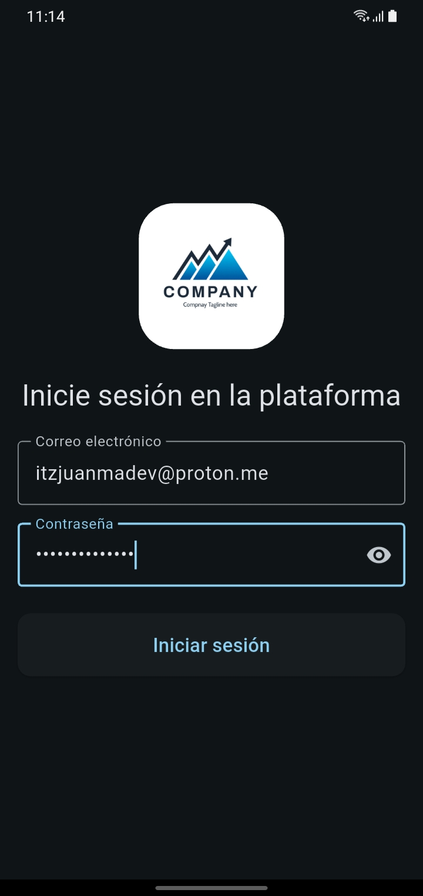
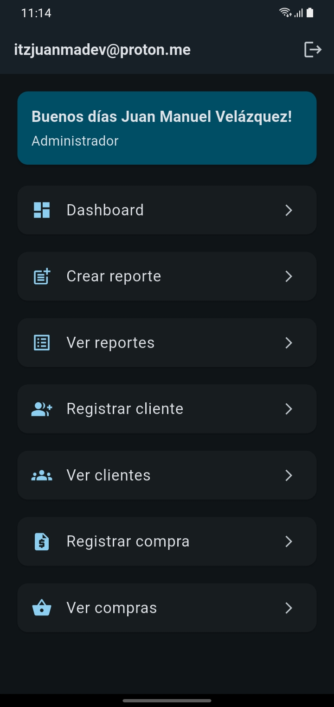
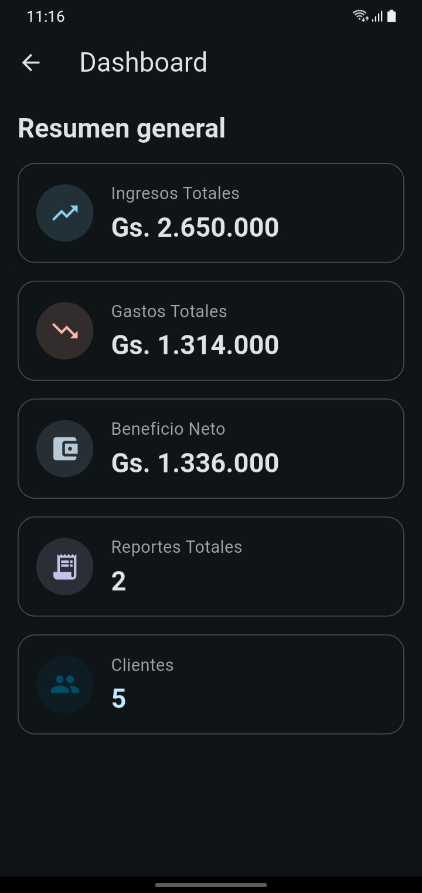
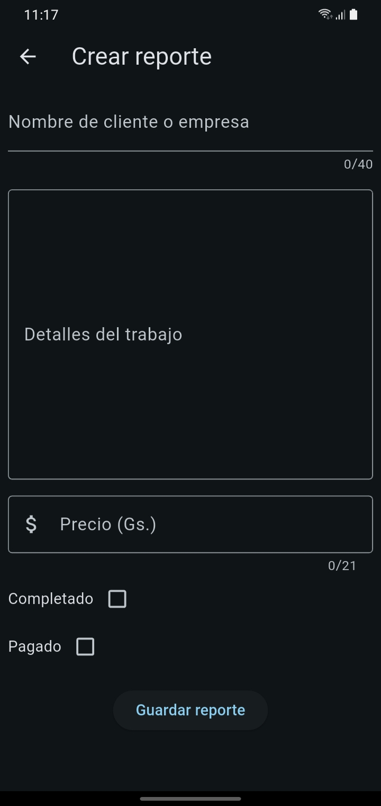

# 🖼️ Capturas de Pantalla






## 1\. Nombre y Objetivo Principal

* **Nombre del Proyecto:** TJM Business Platform.
* **Objetivo Principal:** Es un **sistema de gestión empresarial (ERP/CRM ligero)** diseñado para ayudar a los administradores a llevar un control detallado de las operaciones de su negocio. Permite **monitorear indicadores clave** (ingresos, gastos, beneficio), **gestionar clientes**, y **crear/visualizar/editar reportes** y registros de compras.

## 2\. Stack Tecnológico y Arquitectura

* **Tecnología Principal (Frontend):** **Flutter** (Dart), lo que garantiza la capacidad de ser **multiplataforma** (iOS, Android, Web, **Windows** y **Linux**).
* **Backend & Base de Datos:** **Supabase** (Auth y Base de Datos), utilizado para el manejo de la autenticación de usuarios y la persistencia de los datos del negocio (clientes, reportes, compras).
* **Arquitectura del Código:** El proyecto está estructurado de manera modular en dos paquetes principales:
* **`tjm_business_platform_frontend`:** Contiene la interfaz de usuario (UI) y la lógica de presentación.
* **`tjm_business_platform_logic`:** Una librería separada que actúa como la **Capa de Dominio y la Capa de Datos**, abstrayendo toda la comunicación con Supabase.

## 3\. Funcionalidades Clave

Basado en las imágenes (Login, Menú, Dashboard) y la descripción:

* **Autenticación Segura:** Acceso a la plataforma a través de un **sistema de login** gestionado por Supabase Auth.
* **Dashboard (Resumen General):** Visualización inmediata de métricas financieras clave: **Ingresos Totales**,**Gastos Totales**, **Beneficio Neto**, junto con el conteo de **Reportes** y **Clientes**.
* **Gestión Integral:**
* **Crear y Ver Reportes:** Permite generar nuevos reportes y visualizar el histórico.
* **Gestión de Clientes:** Funcionalidades para **Registrar** y **Ver** el listado de clientes.
* **Gestión de Compras:** Funcionalidades para **Registrar** y **Ver** el listado de compras.
* **Edición:** Capacidad de **editar reportes y clientes** existentes.
* **Plataformas Soportadas:** Android, iOS, Web, **Windows** y **Linux**.

## 4\. Detalles de la Capa Lógica (Para la sección de Arquitectura)

* La capa de dominio y datos reside en el paquete `tjm_business_platform_logic`.
* Esta librería es la **única** que tiene la dependencia directa de `supabase`.
* *(Información extraída de tus datos guardados:)* Para acceder a las funcionalidades de la capa de dominio/datos desde el frontend, se utilizan instancias de las clases `Auth` y `Data`:

```dart
    Auth auth = Auth();
    Data data = Data();
```

-----

## 🚀 Borrador de README.md

A continuación, un borrador estructurado que puedes usar para tu archivo `README.md`.

````markdown
# TJM Business Platform

![TJM Business Platform Logo - Replace with an actual logo]

Una plataforma de gestión empresarial multiplataforma (ERP/CRM ligero) para el control de operaciones, clientes, finanzas y reportes, diseñada para administradores.

## ✨ Características Principales

* **Multiplataforma Nativa:** Desarrollado con Flutter, compatible con **Android**, **iOS**, **Web**, **Windows** y **Linux**.
* **Dashboard Financiero:** Resumen rápido de **Ingresos Totales**, **Gastos Totales**, **Beneficio Neto**, y contadores de clientes y reportes.
* **Gestión de Clientes:** Registro y visualización detallada de la base de clientes, con capacidad de edición.
* **Gestión de Operaciones:** Control de **Reportes** y **Compras**, permitiendo la creación, visualización y edición de registros.
* **Autenticación Segura:** Uso de Supabase Auth para un acceso seguro a la plataforma.

## 🛠️ Tecnologías y Arquitectura

### Stack Tecnológico
| Componente | Tecnología | Uso Principal |
| :--- | :--- | :--- |
| **Frontend/UI** | **Flutter (Dart)** | Interfaz de usuario multiplataforma. |
| **Backend/DB/Auth** | **Supabase** | Base de datos PostgreSQL en la nube, autenticación y almacenamiento. |
| **Paquetes Adicionales** | `window_manager`, `intl`, `uuid` | Gestión de ventanas en Desktop, formateo de fechas/monedas, generación de IDs. |

### Arquitectura Modular

El proyecto está dividido en dos módulos (paquetes) principales para mantener una clara separación de responsabilidades:

1.  **`tjm_business_platform_frontend`**:
    * Contiene todo el código relacionado con la Interfaz de Usuario (`ui`), la gestión de estado (`state`) y el punto de entrada de la aplicación (`main.dart`).

2.  **`tjm_business_platform_logic`**:
    * Una librería de Dart independiente que encapsula la **Capa de Dominio** y la **Capa de Datos**.
    * Es el único módulo con dependencia directa a `supabase`.
    * El acceso a sus funcionalidades de negocio (autenticación y operaciones de datos) se realiza mediante las clases `Auth` y `Data`.

## ⚙️ Configuración e Instalación

### 1. Requisitos

* [Flutter SDK](https://flutter.dev/docs/get-started/install) (versión compatible con Dart ^3.10.0)
* IDE (VS Code o Android Studio)
* **Una instancia de Supabase** (URL del proyecto y Clave API Anónima).

### 2. Clonar el Repositorio

```bash
git clone <URL_DEL_REPOSITORIO>
cd tjm_business_platform
````

### 3\. Configuración de Dependencias

Ejecuta el siguiente comando en el directorio principal para asegurar que los dos paquetes (frontend y logic) resuelvan sus dependencias, incluyendo la dependencia local.

```bash
flutter pub get
```

### 4\. Configuración de Entorno

Debes configurar tu URL y Key de Supabase. Estos valores se deben colocar en el archivo `secrets.dart` del módulo `tjm_business_platform_frontend`.

> **NOTA:** Asegúrate de no subir `secrets.dart` al control de versiones (Git). Se recomienda incluirlo en el `.gitignore`.

```dart
// tjm_business_platform_frontend/lib/secrets.dart
const String supabaseUrl = 'TU_SUPABASE_URL';
const String supabaseAnonKey = 'TU_SUPABASE_ANON_KEY';
```

### 5\. Configuración de la Base de Datos

Ejecuta el script SQL en tu instancia de Supabase para crear las tablas necesarias:

```bash
# El archivo database.sql contiene el esquema necesario
# Sube el contenido de database.sql a tu SQL Editor de Supabase.
```

## 🏃 Ejecución del Proyecto

Para ejecutar la aplicación en el dispositivo/plataforma deseado:

```bash
cd tjm_business_platform/tjm_business_platform_frontend
flutter run
```
