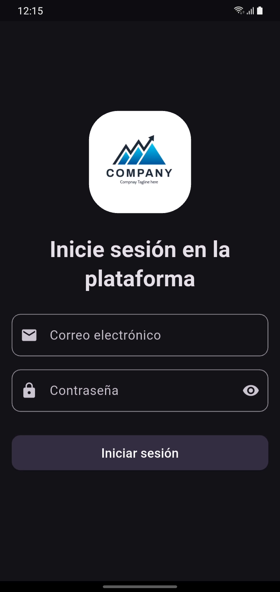
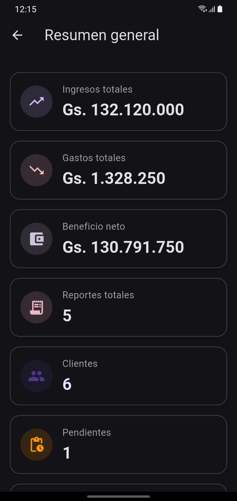
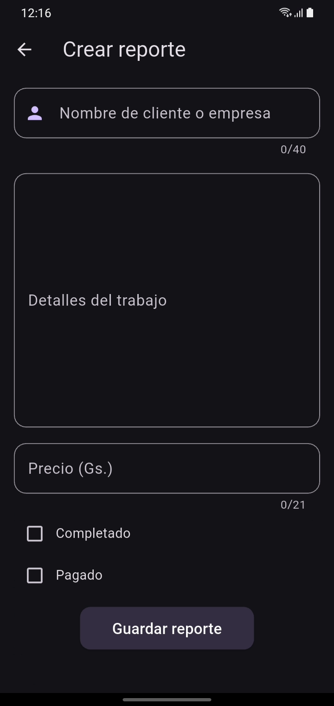

# TJM Business Platform

A comprehensive business management solution designed to streamline operations, manage customers, track expenses, and generate insightful reports.

## Features

*   **Dashboard**: Get a quick overview of your business performance with key metrics and charts.
*   **Customer Management**: Easily add, edit, and view detailed customer information and their work history.
*   **Expense Tracking**: Keep track of all your business expenses and purchases in one place.
*   **Reporting**: Generate detailed reports to analyze income, expenses, and overall profitability.
*   **Authentication**: Secure access to your business data with user authentication.

## Screenshots

<table>
  <tr>
    <td></td>
    <td></td>
    <td></td>
    <td></td>
  </tr>
</table>

## Tech Stack

*   **Frontend**: Flutter
*   **Backend**: Supabase
*   **Desktop Integration**: Window Manager

## Platform Support

This application has been tested and verified on the following platforms:

*   ✅ Android
*   ✅ Windows
*   ✅ Linux

## Installation

To run this project locally, follow these steps:

1.  **Prerequisites**: Ensure you have the [Flutter SDK](https://flutter.dev/docs/get-started/install) installed.

2.  **Clone the repository**:
    ```bash
    git clone <repository-url>
    cd tjm_business_platform
    ```

3.  **Install dependencies**:
    Navigate to the frontend directory:
    ```bash
    cd tjm_business_platform_frontend
    flutter pub get
    ```

4.  **Run the app**:
    ```bash
    flutter run
    ```
